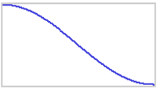

ip.js
=====

Value interpolation utility. Intended for smooth transitions (positions, color values etc.).

Checkout and build
---

	$ git clone git@github.com:npup/ip.js.git
	$ cd ip.js
	$ npm install
	$ npm run build
	$ npm test

Basic usage
---

Create instance and start it

	// in 500 ms, go smoothly from 0 to 100 - then log "done"
	var i = ip.create(0, 100, {
	  "duration": 500
	  , "update": function (value) {
	    	console.log(value);
	  	}
	  , "end": function () {
	  		console.log("done");
	  	}
	}).start();

Instance API:
---

	i.start() // a newly created (or stopped, or ended) instance can be started
	i.stop() // a running instance can be stopped
	i.pause() // a running instance can be paused
	i.resume() // a paused instance can be resumed

All these instance methods returns a reference to the instance.

If you can't wait and rather get the data points upfront to use them in a lookuptable or something, do:

	i.getAllDataPoints() // returns an array of all data points (one for each ms in the duration)
	i.getPercentageDataPoints() // returns an array of 101 data points (0-100)

API
---

	ip.create(from, to[, options]);
		from      - (integer) start value
	 	to        - (integer) end value
	 	options   - (object) options hash:
	              	duration  - (int, default 1000) duration of interpolation in ms
	               	repeats   - (boolean, default false | integer) repeat interpolation (true: forever, integer: nr of extra loops)
	               	roundtrip - (boolean, default false) if interpolation includes returning to initial value
	               	easing    - (function) interpolation easing strategy
	               	each      - (function) callback that receives the current interpolation value after each calculation
	               	update    - (function) callback that receives the current interpolation value after each calculation that results in a new value
	               	end       - (function) callback for when the interpolation ends

Easings
----
The default easing is this function

	function () { return -Math.cos(pos*Math.PI)/2 + 0.5; }

which produces a curve like this:

Just send another function in for an easing of your choice.
